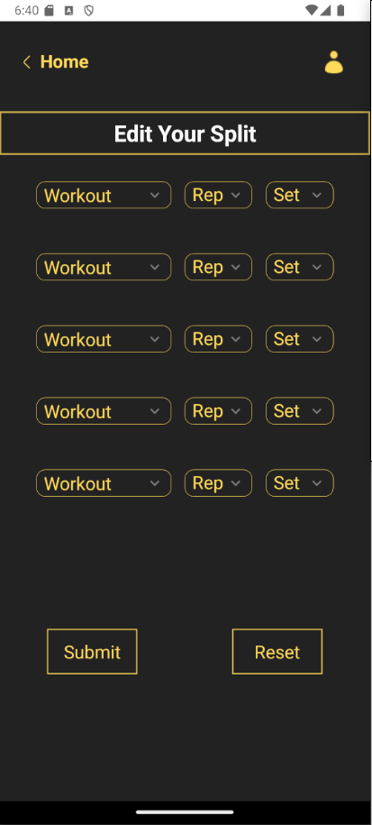
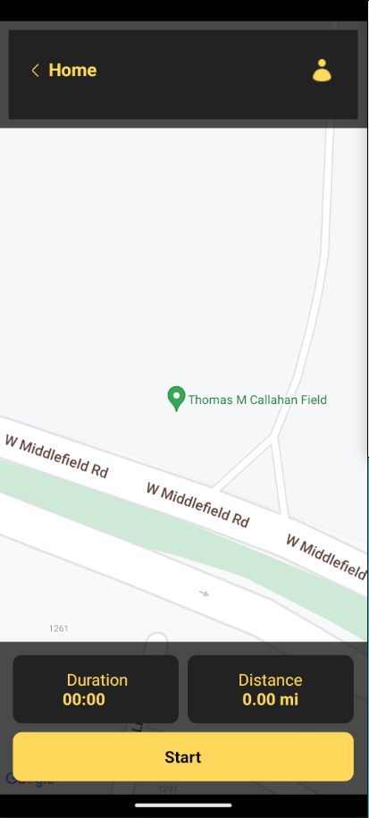

<!-- PROJECT LOGO -->
 

  

<h3 align="center">Back To Back</h3>

  

    A mobile workout app created using React Native with a Supabase hosted backend. The app allows for local groups to compete against each other using score based analytics to maintain discipline in healthy living and developing a healthier lifestyle. Users can set their own splits complete from a list of workouts. Users are also able to track their running whether for speed or stamina.
     
    <a href="https://github.com/github_username/repo_name"><strong>Explore the docs »</strong></a>
     
     
    <a href="https://github.com/github_username/repo_name">View Demo</a>
    ·
    <a href="https://github.com/github_username/repo_name/issues/new?labels=enhancement&template=feature-request---.md">Request Feature</a>
  

<!-- TABLE OF CONTENTS -->

  
Table of Contents

  <ol>
    <li>
      <a href="#about-the-project">About The Project</a>
      <ul>
        <li><a href="#built-with">Built With</a></li>
      </ul>
    </li>
    <li>
      <a href="#getting-started">Getting Started</a>
      <ul>
        <li><a href="#prerequisites">Prerequisites</a></li>
        <li><a href="#demo">Demo</a></li>
      </ul>
    </li>
    <li><a href="#usage">Usage</a></li>
    <li><a href="#roadmap">Roadmap</a></li>
    <li><a href="#contributing">Contributing</a></li>
    <li><a href="#license">License</a></li>
    <li><a href="#contact">Contact</a></li>
    <li><a href="#acknowledgments">Acknowledgments</a></li>
  </ol>

<!-- ABOUT THE PROJECT -->
## About The Project

 
 <!--Leave link to deployed mobile app here-->

Back to back is a mobile workout app that allows small groups to compete against one another to achieve a higher score. Complete with badges that can be earned for fastest, strongest, etc. Complete with a guided workout tool for your splits as well as a running tracker to help calculate speed and stamina, Back to Back will help you and your group reach your fitness goals!

(<a href="#readme-top">back to top</a>)

### Built With

	<code></code>
	<code></code>
	<code></code>
	<code></code>

(<a href="#readme-top">back to top</a>)

<!-- GETTING STARTED -->
## Getting Started
- Move to releases and download the .apk file
- Download on any mobile device
- Go to local files and use your mobile devices package manager to install

### Prerequisites

- Any Android device
- iOS Version (Coming soon)

(<a href="#readme-top">back to top</a>)

<!-- USAGE EXAMPLES -->
## Usage

Use this space to show useful examples of how a project can be used. Additional screenshots, code examples and demos work well in this space. You may also link to more resources.

_For more examples, please refer to the [Documentation](https://example.com)_

(<a href="#readme-top">back to top</a>)

<!-- LICENSE -->
## License

All images are royalty free and all credit goes to the photographers and websites associated.

<!-- CONTACT -->
## Contact
-Personal
Juan Correa - https://www.linkedin.com/in/juan-correa-swe/ - juan.correa.swe@gmail.com

-Contributors
Ryan Sulligan - (insert github)
Joshua Shapiro - (insert github)

(<a href="#readme-top">back to top</a>)

<!-- ACKNOWLEDGMENTS -->
## Acknowledgments

* 
* 
* 

(<a href="#readme-top">back to top</a>)

